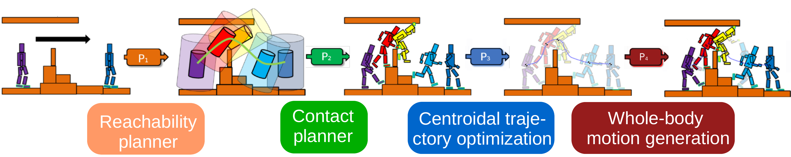
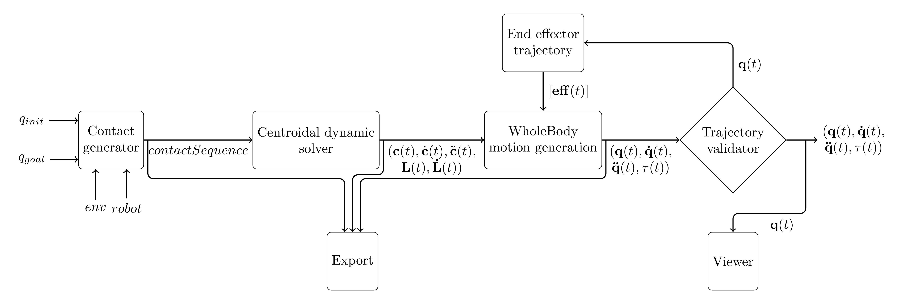

This project implement the framework for multicontact locomotion planning proposed in the [loco-3d](https://hal.laas.fr/hal-01543060) project. 
This framework decompose the global locomotion problem in several subproblems solved sequentially, as shown in the figure below:  




In details, this package implement the following architecture: 




Where all the connections between the blocks are made with objects from the [multicontact-API](https://github.com/loco-3d/multicontact-api) package. Thanks to this, we can have a modular architecture with different methods for solving each blocks but with an unified API. 

The multicontact-locomotion-planning package doesn't implement any of the solvers/methods for any of the blocks but it contains wrapper for the different blocks of the framework and script to automatically formulate problems, retrieve and store solutions such that the input and output of each wrapper is an object from the [multicontact-API](https://github.com/loco-3d/multicontact-api) package. 
Then it implement the connection between each block, along with a lot of helpers for visualization or exports. 

This wrappers are python script that take a user input or an object from the  [multicontact-API](https://github.com/loco-3d/multicontact-api) package, generate a generic problem from the input and call the API of a specific solver. Then it retrieve the solution from the solver and correctly store it in a [multicontact-API](https://github.com/loco-3d/multicontact-api) object. 

The goal of this framework is to be modular, allowing the user to select a method for each of the subproblem or add a wrapper for any new method from the state-of-the-art solving one of this subproblem and connect it seamlessly to the rest of the framework. 

Slides of a presentation of this package : https://cloud.laas.fr/index.php/s/3GbEHLld94asr8H

# Installation procedure :

This package rely on a lot of optionnal packages, see the section 'Available methods' for more information on the installation of this optional packages.

## Install depencies from binary repositories :

1. Add robotpkg to your apt configuration: http://robotpkg.openrobots.org/debian.html
2. `sudo apt update && sudo apt install robotpkg-py27-pinocchio robotpkg-py27-multicontact-api`

## Install depencies from sources : 

Follow the instruction from https://github.com/loco-3d/multicontact-api

## Installation procedure : 
Once the depencies are correctly installed, clone the repository :
``` 
git clone https://github.com/loco-3d/multicontact-locomotion-planning.git
``` 
And add the directory `multicontact-locomotion-planning/script`  to your PYTHONPATH.

# Usage

**TODO**

# Available methods :

Currently supported method for each subproblem, you need to install the packages linked separetely if you want to use this methods.

## Contact generation : 

* RBPRM (https://github.com/humanoid-path-planner/hpp-rbprm-corba#installation-from-binary-package-repository)
* Manually defined (helper methods are available to easily define a gait or a sequence of effector positions)

## Centroidal trajectory optimization : 

* timeoptimization (https://git-amd.tuebingen.mpg.de/bponton/timeoptimization and it's wrapper https://github.com/ggory15/timeopt )
* CROC (https://hal.archives-ouvertes.fr/hal-01726155), included in RBPRM
* 2-PAC (quasi-static) (https://hal.archives-ouvertes.fr/hal-01609055) included in RBPRM

## Wholebody motion generation :

* TSID (https://github.com/stack-of-tasks/tsid)
* CROCODDYL (Work in progress) (https://github.com/loco-3d/crocoddyl)

## Effector trajectories :

* Basic predefined splines
* Limb-RRT (geometric path found by path-planning). Require RBPRM 
* Optimized limb-rrt (Dynamically consistent spline based on the results of limb-rrt)

## Visualization : 

* gepetto-viewer (https://github.com/Gepetto/gepetto-viewer-corba#setup-from-robotpkg-apt-binary-package-repository)

## Export : 

* Blender (with plugin https://github.com/Gepetto/gepetto-viewer-corba/tree/master/blender)
* Gazebo (basic joint-trajectory export)
* OpenHRP (only for HRP-2 robot)
* npz numpy archive (containing all the datas of the wholebody motion)
